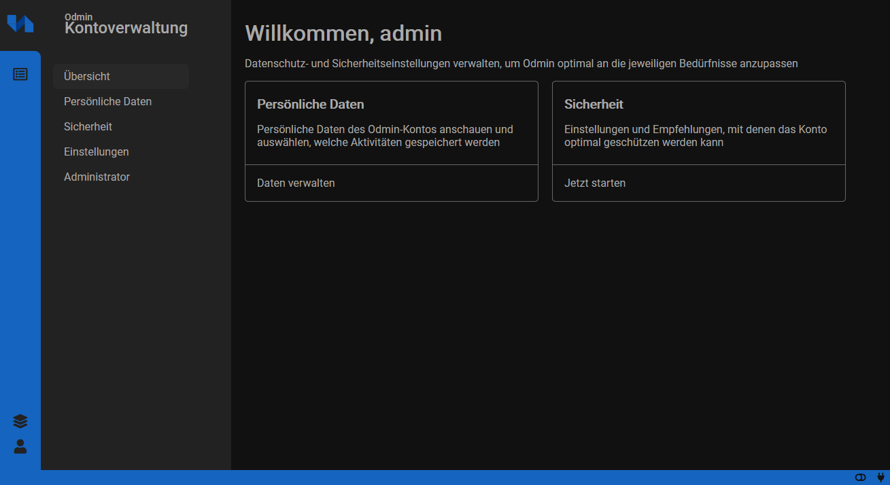

Readme is just a brainstorming for now...


# Odmin
Simple user management with the aim to learn common web security vulnerability.




## Goals

- Cross-domain capable
- WebAuthn support
- e-mail notifications
- JWT
- ...

## check for web security vulnerabilities

- OAuth -> token not in the url
- sql-injection?
- logging + monitoring
- DoS?
- id -> use uuidv4 
- http headers
    - x-frame
    - cors
    - content-type
    - ...
- ...


# getting started

Required are docker, nodejs and npm.

**Backend**
```
cd backend
docker-compose up -d
cp config.sample.json config.json
```

*update config.json*
```
mysql.port <- docker inspect backend_db_1 | grep IPAddress
mysql.port = 3308
mysql.pass = odmin
mysql.database = odmin
mysql.user = odmin
```

*E-Mail debugging**
Test-Server: https://github.com/nodemailer/nodemailer-app

*start backend server*
```
npm i
npm run dev
```

**Backend**
```
cd frontend
npm i
npm start
```
